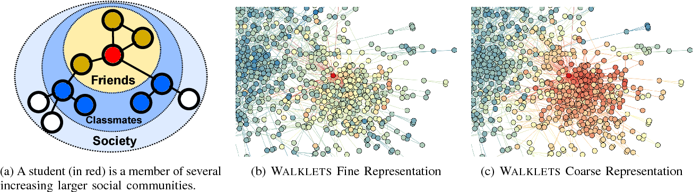

Walklets
================
[](https://arxiv.org/abs/1605.02115) [](https://codebeat.co/projects/github-com-benedekrozemberczki-walklets-master) [](https://github.com/benedekrozemberczki/walklets/archive/master.zip) [](https://twitter.com/intent/follow?screen_name=benrozemberczki) 


	
### Abstract
<p align="justify">
We present Walklets, a novel approach for learning multiscale representations of vertices in a network. In contrast to previous works, these representations explicitly encode multiscale vertex relationships in a way that is analytically derivable. Walklets generates these multiscale relationships by subsampling short random walks on the vertices of a graph. By `skipping' over steps in each random walk, our method generates a corpus of vertex pairs which are reachable via paths of a fixed length. This corpus can then be used to learn a series of latent representations, each of which captures successively higher order relationships from the adjacency matrix. We demonstrate the efficacy of Walklets's latent representations on several multi-label network classification tasks for social networks such as BlogCatalog, DBLP, Flickr, and YouTube. Our results show that Walklets outperforms new methods based on neural matrix factorization. Specifically, we outperform DeepWalk by up to 10% and LINE by 58% Micro-F1 on challenging multi-label classification tasks. Finally, Walklets is an online algorithm, and can easily scale to graphs with millions of vertices and edges.
	
The implementation supports second-order random walk sampling, which was proposed in the original paper but was not implemented in it. The second-order random walks sampling methods were taken from the reference implementation of [Node2vec](https://github.com/aditya-grover/node2vec).</p>

<div style="text-align:center"></div>


This repository provides an implementation of **Walklets** as described in the paper:
> Don't Walk, Skip! Online Learning of Multi-scale Network Embeddings.
> Bryan Perozzi, Vivek Kulkarni, Haochen Chen, Steven Skiena.
> ASONAM, 2017.
> https://arxiv.org/abs/1605.02115

--------------------------------------

The model is now also available in the package [Karate Club](https://github.com/benedekrozemberczki/karateclub).


A C++ implementation of Walklets is available [[here]](https://github.com/cnclabs/smore).

### Requirements

The codebase is implemented in Python 3.5.2 | Anaconda 4.2.0 (64-bit). Package versions used for development are just below.

```
tqdm              4.28.1
numpy             1.15.4
pandas            0.23.4
texttable         1.5.0
gensim            3.6.0
networkx          2.4
```

### Datasets
<p align="justify">
The code takes an input graph in a csv file. Every row indicates an edge between two nodes separated by a comma. The first row is a header. Nodes should be indexed starting with 0. Sample graphs for the `Facebook Politicians` and `Facebook Food` datasets are included in the  `input/` directory.</p>

### Options

Learning of the embedding is handled by the `src/embedding_clustering.py` script which provides the following command line arguments.

#### Input and output options

```
  --input  STR           Input graph path.    Default is `input/food_edges.csv`.
  --output STR           Embeddings path.     Default is `output/food_embedding.csv`.
```
#### Model options

```
  --dimensions  INT      Number of dimensions.                               Default is 16.
  --walk-length INT      Length of random walk per source.                   Default is 80.
  --walk-number INT      Number of random walks per source.                  Default is 5.
  --window-size INT      Window size for proximity statistic extraction.     Default is 5. 
  --min-count   INT      Minimal number of appeareances is to be kept.       Default is 1.
  --workers     INT      Number of cores used for optimization.              Default is 4. 
  --walk-type   STR      Order of random walk.                               Default is `first`.
  --P           FLOAT    Return hyperparameter for second-order walk.        Default is 1.0.
  --Q           FLOAT    In-out hyperparameter for second-order walk.        Default is 1.0.   
```

### Examples

The following commands learn a graph embedding and writes these to disk. The node representations are ordered by the ID.

Creating a Walklet embedding of the default dataset with the default hyperparameter settings. Saving the embedding, cluster centres and the log file at the default path.

```sh
$ python src/main.py
```

Creating an embedding of an other dataset the `Facebook Politicians`. Saving the output and the log in a custom place.

```sh
$ python src/main.py --input input/politicians_edges.csv  --output output/politician_embedding.csv
```

Creating an embedding of the default dataset in 32 dimensions, 20 sequences per source node with length 160.

```sh
$ python src/main.py --dimensions 32 --walk-number 20 --walk-length 160 
```

Creating an embedding of the default dataset in 32 dimensions, 20 sequences per source node with length 160. We use second-order random walk sampling with a custom random walk behaviour setting.

```sh
$ python src/main.py --dimensions 32 --walk-number 20 --walk-length 160 --walk-type second --P 4 --Q 0.25
```
--------------------------------------------------------------------------------

**License**

- [GNU](https://github.com/benedekrozemberczki/Walklets/blob/master/LICENSE)

----------------------------------------------------------------------------
