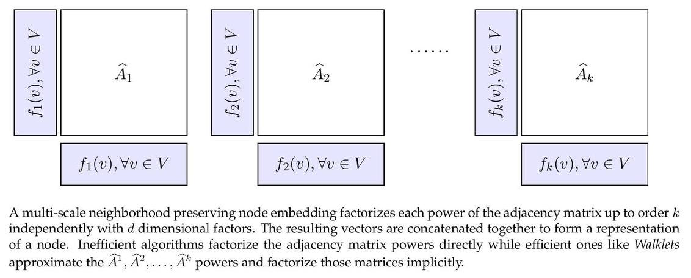

Walklets
============================================
<p align="justify">
Walklets is a multi-scale node embedding algorithm which learns an embedding of approximated adjacency matrix powers up to a given order. Walklet places nodes in an abstract feature space where the vertex features are able to reproduce connectivity patterns in the graph at multiple scales. Embedding is created with an exponential implicit factorization machine. Feature vectors that are extracted in an unsupervised way can be used in downstream machine learning tasks such as edge prediction, node classification and community detection.
  
The implementation supports second-order random walk sampling, which was proposed in the original paper but was not implemented in it. The second-order random walks sampling methods were taken from the reference implementation of [Node2vec](https://github.com/aditya-grover/node2vec).
</p>

<div style="text-align:center"></div>

This repository provides an implementation for Walklets as described in the paper:
> Don't Walk, Skip! Online Learning of Multi-scale Network Embeddings.
> Bryan Perozzi, Vivek Kulkarni, Haochen Chen, Steven Skiena.
> ASONAM, 2017.
> https://arxiv.org/abs/1605.02115


### Requirements


The codebase is implemented in Python 3.5.2 | Anaconda 4.2.0 (64-bit). Package versions used for development are just below.

```
tqdm              4.28.1
numpy             1.15.4
pandas            0.23.4
texttable         1.5.0
gensim            3.6.0
networkx          1.11
```

### Datasets

The code takes an input graph in a csv file. Every row indicates an edge between two nodes separated by a comma. The first row is a header. Nodes should be indexed starting with 0. Sample graphs for the `Facebook Politicians` and `Facebook Food` datasets are included in the  `input/` directory.

### Options

Learning of the embedding is handled by the `src/embedding_clustering.py` script which provides the following command line arguments.

#### Input and output options

```
  --input  STR           Input graph path.    Default is `input/food_edges.csv`.
  --output STR           Embeddings path.     Default is `output/food_embedding.csv`.
```
#### Model options

```
  --dimensions  INT      Number of dimensions.                               Default is 16.
  --walk-length INT      Length of random walk per source.                   Default is 80.
  --walk-number INT      Number of random walks per source.                  Default is 5.
  --window-size INT      Window size for proximity statistic extraction.     Default is 5. 
  --min-count   INT      Minimal number of appeareances is to be kept.       Default is 1.
  --workers     INT      Number of cores used for optimization.              Default is 4. 
  --walk-type   STR      Order of random walk.                               Default is `first`.
  --P           FLOAT    Return hyperparameter for second-order walk.        Default is 1.0.
  --Q           FLOAT    In-out hyperparameter for second-order walk.        Default is 1.0.   
```

### Examples

The following commands learn a graph embedding and writes these to disk. The node representations are ordered by the ID.

Creating a Walklet embedding of the default dataset with the default hyperparameter settings. Saving the embedding, cluster centres and the log file at the default path.

```
python src/main.py
```

Creating an embedding of an other dataset the `Facebook Politicians`. Saving the output and the log in a custom place.

```
python src/main.py --input input/politicians_edges.csv  --output output/politician_embedding.csv
```

Creating an embedding of the default dataset in 32 dimensions, 20 sequences per source node with length 160.

```
python src/main.py --dimensions 32 --walk-number 20 --walk-length 160 
```

Creating an embedding of the default dataset in 32 dimensions, 20 sequences per source node with length 160. We use second-order random walk sampling with a custom random walk behaviour setting.

```
python src/main.py --dimensions 32 --walk-number 20 --walk-length 160 --walk-type second --P 4 --Q 0.25
```
